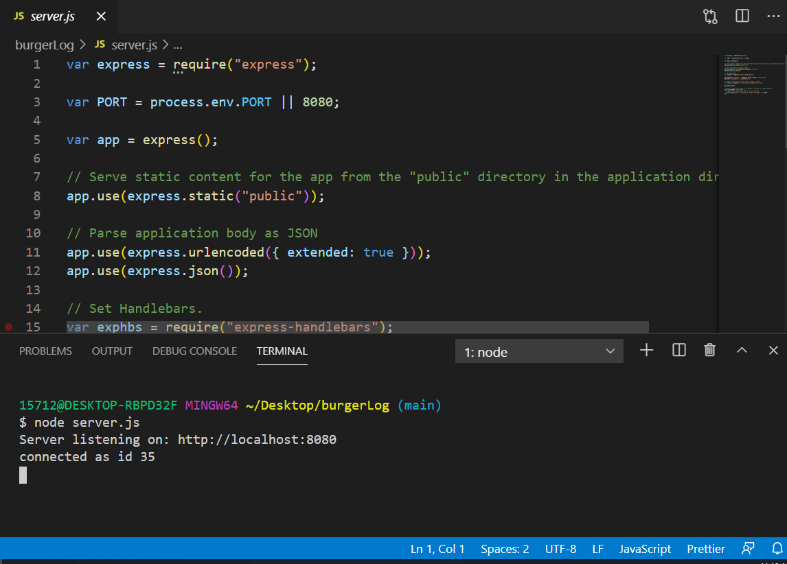
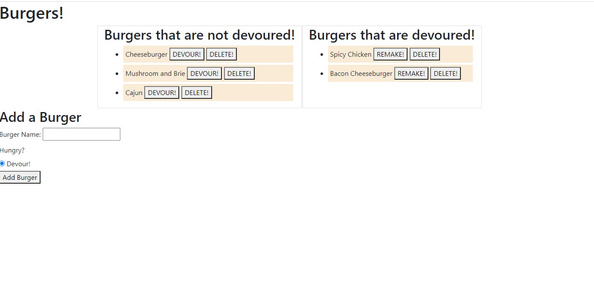

# Burger Log 
        
## Discription 
Takes in a burger order and logs it into a database.  It then can move between columns based on users selection and also can be deleted.
        
## Table of Contents 
* [Installation](#Installation)
        
* [Installation](#Installation)
        
* [Usage](#Usage)
        
* [License](#License)
        
* [Contributing](#Contributing)
        
* [Tests](#Tests)
        
* [Questions](#Questions)
        
## Installation 
node index.js
        
## Usage 

        
## License 
ISC
        
## Contributing 
Allan
        
## Tests 
None
        
## Questions 
[chefbrams](https://github.com/chefbrams)
         
Contact me by email with any further questions.
        
oldcitycatering@gmail.com  

        